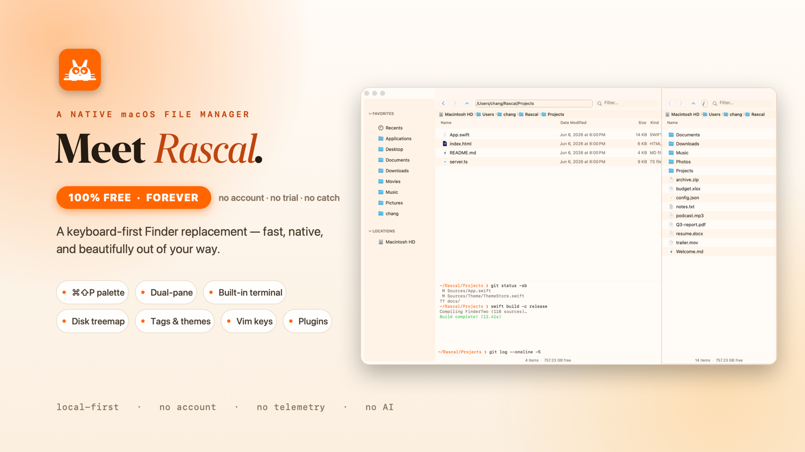

# Rascal



**A fast, keyboard-first Finder replacement for macOS.** Native AppKit — dual panes, a fuzzy command palette, vim keys, a live disk treemap, real Finder tags, an inline terminal, and a JavaScript plugin API.

`Free · local-first · no account · no telemetry · no AI · macOS 13+ · Apple Silicon & Intel`

Rascal opens instantly, runs entirely on your Mac, and never phones home.

**[⬇ Download](https://github.com/chang-07/finder-2/releases/latest)** · [Keymap](HOTKEYS.md) · [User guide](https://chang-07.github.io/finder-2/guide.html) · [Customize](https://chang-07.github.io/finder-2/customize.html)

---

## Download

Grab the latest signed DMG from [**Releases**](https://github.com/chang-07/finder-2/releases/latest) (Apple Silicon or Intel), drag **Rascal** to **Applications**, and open it.

Because the build is ad-hoc signed, right-click **Rascal.app → Open** the first time. If macOS still blocks it:

```bash
xattr -cr /Applications/Rascal.app
```

Prefer to build it yourself? See [Build from source](#build-from-source).

## Highlights

- **Keyboard-first** — fuzzy command palette (`⌘⇧P`) and real vim navigation (`hjkl`, `/`, `dd`, `gg`, `gt`). The mouse is optional.
- **Panes & views** — dual and multi-pane layouts, tabs, and List / Icon / Column / Gallery, switchable in a keystroke.
- **Disk treemap** — a live, colour-coded map of any folder; click a tile to drill in.
- **Real Finder tags** — read and write `kMDItemUserTags`, and pin saved searches to the sidebar as smart folders.
- **Inline terminal** — `` ⌘` `` drops a shell drawer that tracks the active pane's directory.
- **Plugins** — add commands with a small JavaScript file. No build step, no npm.
- **17 themes** — light, dark, and a dozen more, or write your own in a few lines of JSON.
- **Fast** — direct `readdir`/`lstat` scanning and async sort/filter keep large folders smooth. See [Performance](#performance).

## Build from source

Requires **macOS 13+** and a **Swift 5.9+ toolchain** — Command Line Tools (`xcode-select --install`) are enough; full Xcode is not required. It's a plain SwiftPM package with no `.xcodeproj`.

```bash
git clone https://github.com/chang-07/finder-2.git
cd finder-2

./run.sh                 # build (debug) + launch in place
# or
./build.sh debug         # → build/Rascal.app
./build.sh release       # optimized build
./install.sh             # release build → /Applications + a `ft` CLI
```

After `./install.sh`, open Rascal from anywhere:

```bash
ft                       # open the current directory
ft ~/Downloads           # open a path
```

## Essential shortcuts

| Shortcut | Action |
|---|---|
| `⌘⇧P` | Command palette |
| `⌘F` / `⌘⇧F` | Find files (fuzzy) / search file contents |
| `⌘\` | Toggle extra pane |
| `⌘T` / `⌘W` | New / close tab |
| `⌘↑` / `⌘↓` | Enclosing folder / open selection |
| `Return` / `Space` | Rename / Quick Look |
| type letters | Live filter (`Esc` clears) |
| `` ⌘` `` | Inline terminal |
| `⌘,` | Settings (themes, vim, shortcuts) |

Vim mode (toggle in Settings) maps `h j k l`, `gg`, `G`, `gt`/`gT`, `dd`, `yy`, `p`, `r`, `/`, `:`, and more when the file list is focused. The **full keymap** is in [HOTKEYS.md](HOTKEYS.md).

## Testing

Two scripts. Both run **off-screen** — windows never appear and focus is never taken.

```bash
./smoketest.sh           # in-process functional runner — 200+ assertions
./guitest.sh             # Accessibility audit of menus + shortcuts
```

`smoketest.sh` launches the binary with `FT_RUN_TESTS=1`; the in-process `TestRunner` builds real controllers, panes, sheets, the palette, and vim, then asserts on their state — it is the source of truth. `guitest.sh` (`FT_HEADLESS_TESTING=1`) is a guardrail that every menu item and shortcut stays wired.

## Project layout

```
Sources/FinderTwo/                 # the Swift target is named FinderTwo (historical); the product is Rascal
├── main.swift / AppDelegate.swift # entry, menu bar, session restore
├── Model/      Actions.swift (command registry), DirectoryModel, FileItem, Workspaces
├── FS/         FastDirScan, FileOps, Tags, DirectoryWatcher (FSEvents)
├── Input/      VimMode.swift
├── Theme/      ThemeStore.swift (17 themes) + ThemeManager
├── UI/         PaneController, FileListController, ColumnViewController, CommandPalette,
│               SearchSheet, BatchRename, TreemapView, Settings, … (most of the app)
├── Window/     BrowserWindowController (sidebar | panes split), PanesContainerController
├── DemoShot.swift                 # off-screen capture harness for the website media
└── Tests/TestRunner.swift         # 200+ in-process assertions
```

`Package.swift` links only system frameworks (AppKit, NetFS, Security) — there are **no third-party Swift dependencies**.

## Contributing

Pull requests are welcome: bug fixes, features, themes, plugins, and docs. A few things keep Rascal coherent — please keep them in mind.

### Principles

- **Local-first and private.** No telemetry, no analytics, no "call home." A change that sends user data anywhere won't be merged.
- **No AI features.** Rascal is deliberately AI-free.
- **Native and fast.** AppKit only — no Electron or web views for core UI. Respect the hot paths: keep UI work on the main thread and heavy work off it.
- **Few dependencies.** The app ships with zero third-party Swift packages; it leans on system frameworks and CLI tools (`unzip`, `tar`, `rg`/`grep`, `sftp`, `git`). New dependencies need a strong reason.
- **Keyboard-first.** New features should be reachable without the mouse — register them as Actions so the palette and menus pick them up.

### Set up

```bash
git clone https://github.com/chang-07/finder-2.git
cd finder-2
./run.sh            # build + launch
```

macOS 13+ and a Swift 5.9+ toolchain (Command Line Tools are enough). Edit in any editor; `swift build` works directly.

### Before you open a PR

1. `./build.sh debug` compiles clean — fix any new warnings.
2. `./smoketest.sh` passes (200+ assertions).
3. `./guitest.sh` passes (menu/shortcut audit).
4. Add assertions for new behaviour to `Sources/FinderTwo/Tests/TestRunner.swift`.

**Headless-testing rule:** tests and any off-screen rendering must never open a visible window or take focus. The harness parks windows far off every display (`FT_HEADLESS_TESTING=1`) and snapshots them with `CGWindowList`. If you add a capture or demo, follow the off-screen pattern in `DemoShot.swift` — never `makeKeyAndOrderFront` onto a real screen.

### How things are wired

- **Commands are data.** Add new actions to `Model/Actions.swift` (id, title, default shortcut); they appear in the command palette and menu bar automatically, then handle them in the relevant controller.
- **Preferences** live under the `FinderTwo.*` `UserDefaults` namespace — keep the prefix.
- **Themes:** add a `ThemeSpec` to `Theme/ThemeStore.swift` (id, name, appearance, hex colours). Users can also drop a JSON theme in the Themes folder with no rebuild.
- **Plugins** are JavaScript (`manifest.json` + `main.js` in a `.ftplugin` bundle) — no rebuild required. See the [Customize guide](https://chang-07.github.io/finder-2/customize.html).
- **Don't change** `CFBundleIdentifier` (`dev.chang.FinderTwo`) or the `~/Library/Application Support/FinderTwo` paths — they are load-bearing for granted permissions and existing users' data.

### Style

- Match the surrounding code: 4-space indent, early returns, descriptive names.
- Comment the *why* for non-obvious AppKit workarounds — the codebase favours that.
- Avoid force-unwraps in fallible runtime paths.

### Commits & PRs

- Branch off `main`; keep each PR focused on one thing.
- Commit subjects in the imperative, no trailing period — e.g. `Fix column-view icon caching`.
- In the PR, say what changed, why, and how you tested it. For visual changes, attach an off-screen `DemoShot` capture rather than a live screenshot.

### Where help is wanted

- Git-status overlay polish, a custom keyboard-shortcut editor, 1M-item virtualized scrolling, and inline-preview improvements are all open.
- New **themes** and **plugins** are low-risk and always welcome.

## Performance

| Workload | Rascal |
|---|---|
| Cold launch → window on screen | ~230 ms |
| Scan 5,000 files (`FastDirScan`) | ~22 ms |
| Sync reload 5,000 files | ~33 ms |
| Live filter, 5,000 files | ~50 ms |
| Progressive filter (extend a prefix) | ~4 ms |

Measured on an M3 MacBook Pro from the release binary; the same numbers print live from `./smoketest.sh`. The wins come from direct `opendir`/`readdir`/`lstat` scanning, async sort/filter that spills to a background queue past ~2,000 items, progressive filtering, a per-extension icon cache, and a throttled status bar. The reasoning lives in the source comments of `FS/FastDirScan.swift` and `Model/DirectoryModel.swift`.

## Themes

Seventeen built-in: Rascal Light & Dark, Midnight, Sepia, Hacker, Nord, Dracula, Solarized (light & dark), High Contrast, Ocean, Cyberpunk, Gruvbox, Sage, Tokyo Night, Rose Pine, and Catppuccin Mocha — plus a System option that follows macOS. Switch in Settings (`⌘,`) or via the palette, or write your own JSON theme.

## License

[MIT](LICENSE) © 2026 chang. Free and open source — no cloud, no account, no telemetry.
